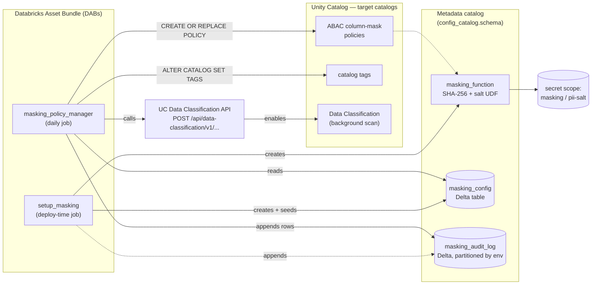
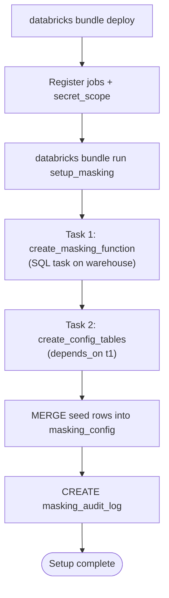
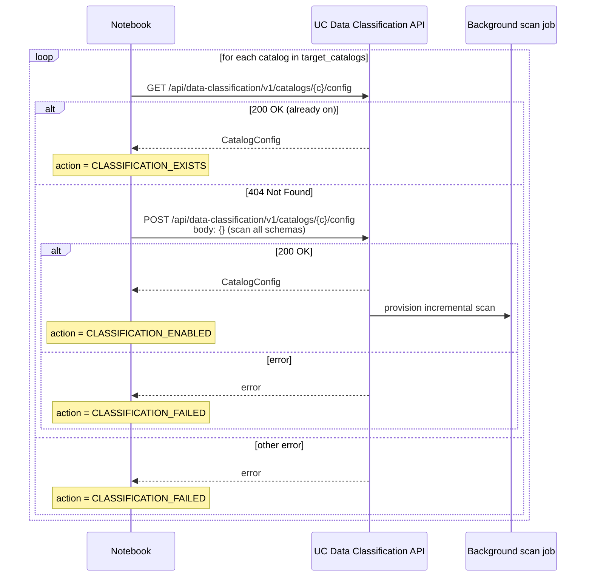
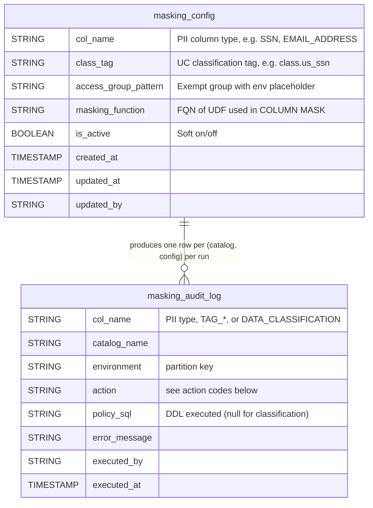
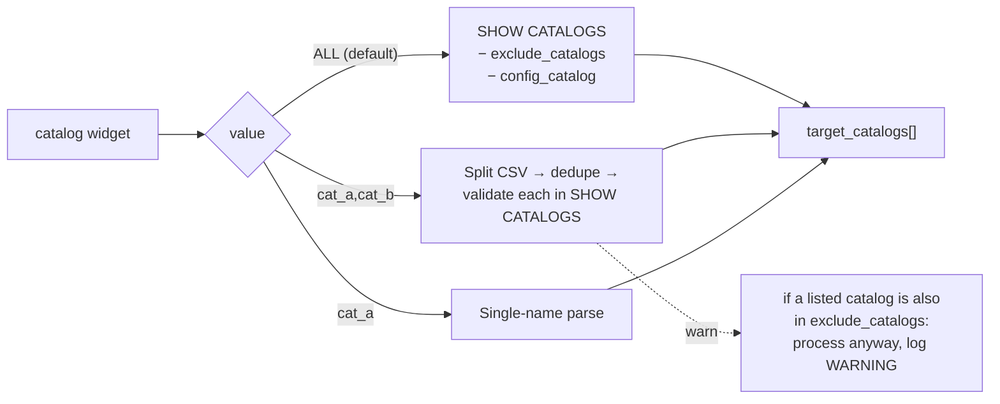
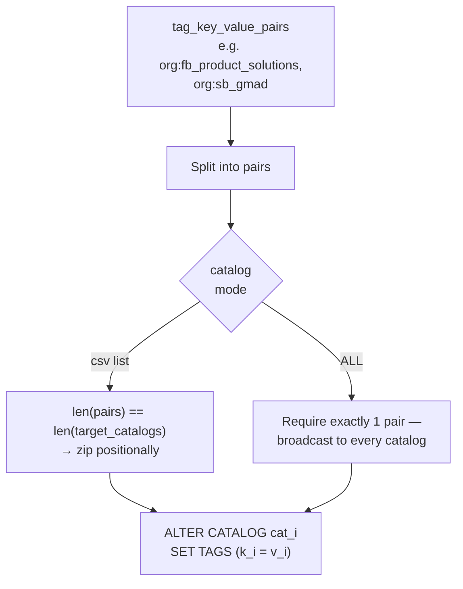
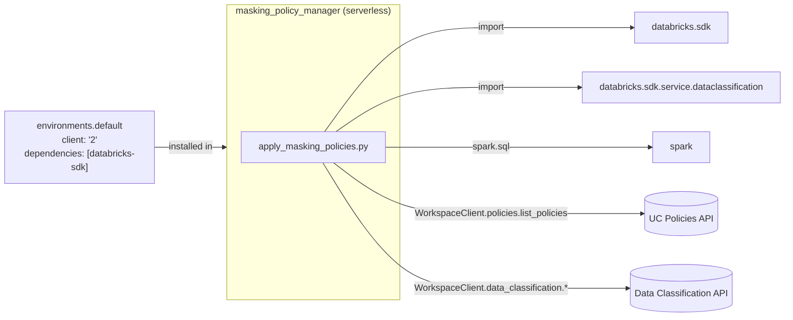

# UC ABAC Masking Policy Manager — Architecture

End-to-end explanation of how this bundle deploys masking infrastructure and
keeps Unity Catalog policies, tags, and data classification in sync with a
declarative config table.

All diagrams use [Mermaid](https://mermaid.js.org/) and render natively on
GitHub.

---

## 1. Component overview

What the bundle deploys and how the runtime pieces talk to each other.

Key idea: **`masking_config` is the source of truth.** Every row maps a logical
PII column type to (a) the classification tag a column must carry, (b) the
access group exempt from masking, and (c) the masking UDF. The apply job is a
pure projection of that table onto the target catalogs.

---

## 2. Deploy-time setup flow

`bundle deploy` registers resources; `bundle run setup_masking` does the
one-time DDL. Idempotent — safe to re-run.

UDF must exist before the tables because `masking_config.masking_function`
defaults to its fully-qualified name.

---

## 3. Apply notebook — control flow

This is what runs every day (or on demand). One pass over every target
catalog, three governance operations (policies, tags, classification), one
audit log.

```mermaid
flowchart TD
  trig(["Job trigger / scheduled run"]) --> w["Read widgets:<br/>catalog, exclude_catalogs,<br/>force_reapply, tag_key_value_pairs,<br/>enable_data_classification"]
  w --> env["Derive env from workspace URL<br/>(e.g. nyl-builder-dev → 'dev')"]
  env --> rc{"catalog<br/>param?"}
  rc -- "ALL" --> all["SHOW CATALOGS<br/>minus exclude_catalogs<br/>minus config_catalog"]
  rc -- "csv list" --> parse["Split + dedupe +<br/>validate each exists"]
  rc -- "single" --> parse
  all --> targets["target_catalogs[]"]
  parse --> targets

  targets --> load["SELECT * FROM masking_config<br/>WHERE is_active = true"]
  load --> ex["ThreadPool(16):<br/>list_policies per catalog<br/>via WorkspaceClient.policies"]
  ex --> applyloop["For each (catalog, config row):<br/>build CREATE OR REPLACE POLICY"]

  applyloop --> existsq{"Policy<br/>already exists?"}
  existsq -- "yes + !force_reapply" --> skip["action=SKIPPED"]
  existsq -- "no or force_reapply" --> doit["spark.sql(policy_sql)"]
  doit -- "ok" --> app["action=APPLIED"]
  doit -- "exception" --> fail["action=FAILED"]
  skip --> tagcell
  app --> tagcell
  fail --> tagcell

  tagcell{"tag_key_value_pairs<br/>provided?"} -- "yes" --> mapping["Positional mapping<br/>(or broadcast if catalog=ALL)"]
  mapping --> altertag["ALTER CATALOG SET TAGS<br/>→ TAG_APPLIED / TAG_FAILED"]
  tagcell -- "no" --> dccell
  altertag --> dccell

  dccell{"enable_data_<br/>classification?"} -- "true" --> dcloop["For each catalog:<br/>GET config → 404? POST : skip"]
  dccell -- "false" --> auditw
  dcloop --> auditw["Append all results<br/>to masking_audit_log"]

  auditw --> summary["Summary + counts"]
  summary --> exitq{"Any failures?"}
  exitq -- "no" --> ok(["dbutils.notebook.exit(SUCCESS)"])
  exitq -- "yes" --> bad(["Failures listed;<br/>job fails → email alert"])
```

---

## 4. Data Classification — idempotency

The classification cell uses the SDK directly. `create_catalog_config` rejects
duplicates, so we GET first and only POST when the config does not exist.

Failures here surface in `all_failures` and fail the job — which triggers the
`on_failure` email and visibility in run history.

---

## 5. Data model

### Action codes

| Action                   | Cell                | Meaning                                                       |
| ------------------------ | ------------------- | ------------------------------------------------------------- |
| `APPLIED`                | policies            | New / forced CREATE OR REPLACE POLICY ran                     |
| `SKIPPED`                | policies            | Policy already present, `force_reapply=false`                 |
| `FAILED`                 | policies            | Spark SQL raised                                              |
| `TAG_APPLIED`            | tags                | `ALTER CATALOG SET TAGS` succeeded                            |
| `TAG_FAILED`             | tags                | Invalid `key:value` format or DDL error                       |
| `CLASSIFICATION_ENABLED` | data classification | `POST /config` succeeded — scan provisioned                   |
| `CLASSIFICATION_EXISTS`  | data classification | `GET /config` returned existing config — skipped              |
| `CLASSIFICATION_FAILED`  | data classification | GET (non-404) or POST error                                   |

`FAILED + TAG_FAILED + CLASSIFICATION_FAILED` → non-empty `all_failures` →
job fails → `on_failure` email fires.

---

## 6. Catalog targeting

How the `catalog` widget collapses to `target_catalogs[]`.

Explicit user intent always wins over the exclude list.

---

## 7. Tag mapping (positional)

`tag_key_value_pairs` is a comma-separated `key:value` list. Mapping rule:

Mismatched lengths raise — early fail is intentional, prevents silent
misalignment between catalogs and tags.

---

## 8. Runtime dependencies

The `environments` block in `databricks.yml` pins the latest `databricks-sdk`
so the `dataclassification` service module — which is newer than the
SDK shipped on default DBR images — is importable at runtime.

---

## 9. File map

| Path                                          | Role                                                                              |
| --------------------------------------------- | --------------------------------------------------------------------------------- |
| `databricks.yml`                              | Bundle definition: vars, targets (dev/qa/prod), `setup_masking` + `masking_policy_manager` jobs, serverless env |
| `sql/create_masking_function.sql`             | SHA-256 + salt UDF (reads `pii-salt` secret)                                      |
| `sql/create_masking_tables.sql`               | `masking_config` (+ MERGE seed) and `masking_audit_log` DDL                       |
| `notebooks/apply_masking_policies.py`         | Daily job: resolve catalogs → policies → tags → data classification → audit      |
| `scripts/run_masking_job.py`                  | CLI to trigger the daily job via the Jobs API                                     |
| `DEPLOYMENT.md`                               | Step-by-step deploy + run guide                                                   |
| `TESTING.md`                                  | Validation & test procedures                                                      |

---

## 10. Failure & recovery

- **Per-catalog isolation** — every loop catches its own exception and
  records a `*_FAILED` row; one bad catalog does not stop the others.
- **Audit-first** — the audit log is written before the summary cell, so
  failures are inspectable even when the job exits non-zero.
- **Idempotent reruns** — policies skip if present (`SKIPPED`),
  classification skips if configured (`CLASSIFICATION_EXISTS`), MERGE seeds
  the config without duplicating rows. Safe to re-run any cell or the whole
  job.
- **Force re-apply** — `force_reapply=true` overrides the policy skip when
  the underlying UDF or access group changes.
